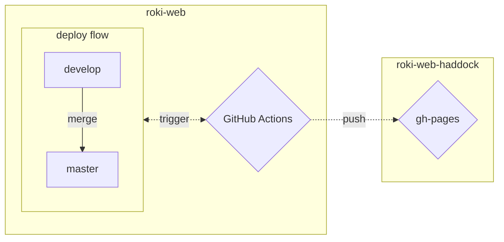

# roki-web-haddock

[roki-web](https://github.com/falgon/roki-web) implementation code documentation

```mermaid
graph LR
subgraph rw[roki-web]
    subgraph df[deploy flow]
        d[develop]-->|merge|m[master]
    end
    df<-.trigger.->ga{GitHub Actions}
 end
subgraph rwh[roki-web-haddock]
ga-.push.->phg{gh-pages}
end

click ga "https://github.com/falgon/roki-web/actions/workflows/haddock.yml"
click ghp "https://github.com/falgon/roki-web-haddock/tree/gh-pages"
click rw "https://github.com/falgon/roki-web" "link"
```
